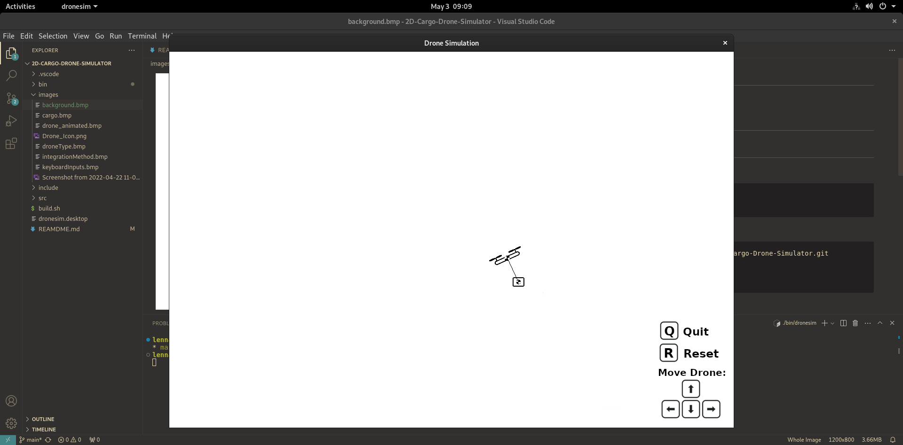

# 2D Drone simulator with cargo



<!---->

## Overview
A 2D Drone Simulator with cargo on a rope. A controller stabilizes the drone and the drone and actively stops the cargo from swinging. Written in C++ with SDL2 for visualization.

## Installation

Install dependencies sdl2 and sdl2_ttf:
```
sudo apt-get install libsdl2-dev
sudo apt-get install libsdl2-ttf-dev
```
Clone the repo and build the program:
```
git clone https://github.com/LennardMarx/2D-Cargo-Drone-Simulator.git
cd 2D-Cargo-Drone-Simulator
chmod +x build.sh
./build.sh
```
Run the program:
```
./bin/dronesim
```

## Controls
On startup choose drone type (with or without cargo) and integration method (Euler vs. Runge-Kutta 4). Fly the drone with the arrow keys, reset the drone with "r", quit the game with "q". The controller can be turned off with "x", which nicely shows what the controller is doing.

## Theory
Might follow.

## Desktop Application
For now only works when the file is edited accordingly and put into ~/.local/share/applications. An automatic generation script might follow.